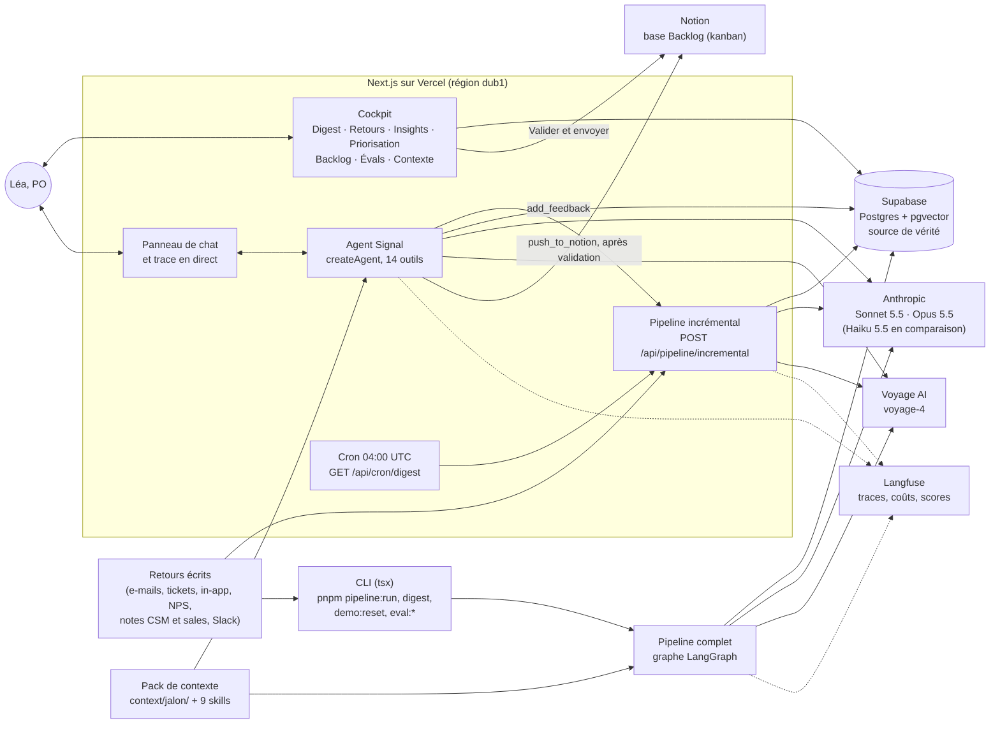
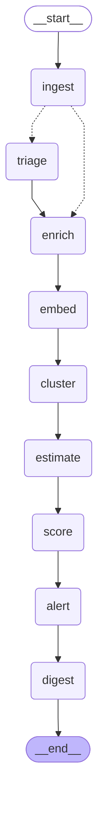
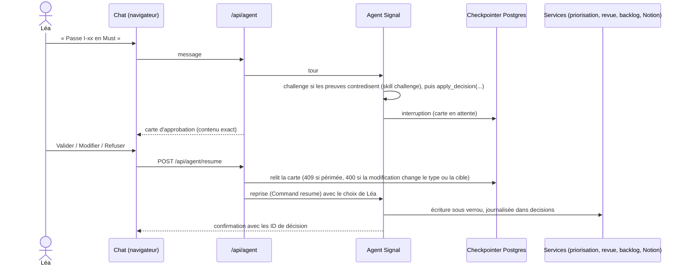

# Architecture de Signal

Ce document décrit ce qui est construit. Le quoi et le pourquoi sont dans [SPEC.md](../SPEC.md) (§6 pour l'architecture prévue) ; chaque choix daté est une ADR de [DECISIONS.md](DECISIONS.md) ; les chiffres de qualité sont dans [EVALS.md](EVALS.md).

En une phrase : **un workflow pour le volume, un agent unique pour l'interaction**, autour d'une seule base. Le pipeline trie et regroupe les retours ; l'agent Signal lit cette base avec ses outils, rédige et propose ; toute décision et toute écriture externe attendent le clic du PO.

## Vue d'ensemble

- **Une seule base.** Le pipeline et l'agent lisent et écrivent les mêmes tables Supabase, uniquement côté serveur, avec la clé service role (ADR-002) : aucun client Supabase dans le navigateur, RLS activée sans policy.
- **Un seul point d'entrée vers les modèles** : `src/lib/llm` (rôles, sorties structurées validées par zod, cache de prompt, coût en euros, traces Langfuse ; ADR-003). Une règle ESLint interdit les SDK des modèles ailleurs.
- **Les calculs en code** (`src/lib/scoring`, `src/lib/clustering`, `src/lib/estimation`, `src/lib/insights`), testés et couverts à 100 % pour le cœur ; le modèle ne fournit que des jugements (Impact, alignement, MoSCoW recommandé, fourchette brute d'effort, textes).
- **La connaissance métier hors du code** : le pack `context/jalon/` (produit, stratégie, personas, équipe, carte d'architecture, engagements, glossaire, `weighting.yaml`) et 9 skills, chargés par le pipeline comme par l'agent (ADR-004).

## Pipeline

Le pipeline d'ingestion est un **workflow** LangGraph (`src/pipeline/graph.ts`, ADR-013 ; décisions 001 et 003 de SPEC §6.5) : le traitement de masse doit être prévisible, reproductible et mesurable. Le graphe ci-dessous est exporté du code (`drawMermaid()`) ; un test vérifie qu'il est à jour.

| Nœud       | Type                                          | Ce qu'il fait                                                                                                                                                                   |
| ---------- | --------------------------------------------- | ------------------------------------------------------------------------------------------------------------------------------------------------------------------------------- |
| `ingest`   | code                                          | Liste les retours sans analyse réussie (les échecs précédents sont retentés), les marque du `run_id`, photographie les insights émergents                                       |
| `triage`   | Sonnet (rôle `reasoning`, ADR-035), structuré | Fan-out par lots de 10 (`Send`), 2 lots en parallèle (`maxConcurrency`) × 4 appels ; un retour en échec est marqué `failed` sans bloquer le run                                 |
| `enrich`   | code                                          | Rattachement au compte, signaux business                                                                                                                                        |
| `embed`    | Voyage                                        | Vecteur « problème — résumé » des items qui n'en ont pas                                                                                                                        |
| `cluster`  | code + Sonnet                                 | Regroupement, appariement aux insights existants et étiquetage (un seul plan, écrit après tous les appels de modèle : c'est le trio `cluster` · `match` · `label` de SPEC §6.1) |
| `estimate` | Sonnet, en cache                              | Fourchette de points des insights classés                                                                                                                                       |
| `score`    | Sonnet + code                                 | Jugement par le modèle, calculs en code, nouvelle version dans `scores`                                                                                                         |
| `alert`    | code                                          | Seuils de SPEC §10.10 sur les retours du run ; rien au premier run (tout va au digest)                                                                                          |
| `digest`   | code + Sonnet                                 | Faits de la période calculés en code, rédaction par Signal (skill `digest`), ID vérifiés en code ; repli sur un rendu brut des faits si la rédaction échoue                     |

**État.** Le graphe ne transporte que des ID, des compteurs et des coûts (`run_id`, retours à trier, retours triés, insights créés, échecs, stats, coût) ; les données vivent dans Supabase.

**Idempotence et reprise (CL-11, CL-13).** Chaque nœud lit en base ce qui reste à faire. Le graphe est compilé avec un `PostgresSaver` (schéma `langgraph`, hors de l'API PostgREST) ; `pnpm pipeline:run --resume <run_id>` repart du dernier checkpoint : les nœuds terminés, et les lots de triage terminés, ne sont pas rejoués. Les erreurs passagères sont retentées une fois par nœud (`retryPolicy`).

**Verrou (CL-12).** `src/pipeline/lock.ts` prend `pg_try_advisory_lock` sur une connexion Postgres dédiée pour toute la durée d'un run, complet ou incrémental. Un second run réessaie pendant 30 s, puis abandonne avec « Run en cours, réessaie dans un instant. » (code 2 en CLI, 409 sur la route).

**Mode incrémental** (`src/pipeline/incremental.ts`, `POST /api/pipeline/incremental`). 1 à 10 retours : triage → enrich → embed → rattachement à l'insight le plus proche (similarité moyenne aux items de l'insight, comme le regroupement complet en _average linkage_, au même seuil) ou file « à surveiller » ; dès que 3 items de la file sont proches, nouvel insight `propose` → agrégats des insights touchés → re-score en code (le jugement du modèle stocké dans `scores.judgment` est réutilisé ; Reach, Confidence, règles MoSCoW, RICE et rangs sont recalculés pour tous ; seul un insight sans jugement valide, par exemple devenu classé, est jugé et estimé) → alertes. Le run complet de nuit rejuge tout. La réponse décrit, par retour, ce qu'il est devenu ; `pipeline_runs.stats.timings_ms` donne la durée de chaque étape.

**Alertes** (`src/pipeline/nodes/alert.ts`). Une alerte par sujet et par type sur 24 h (`dedup_key` = type | sujet | date) ; les suivantes enrichissent l'alerte ouverte (CL-55). Le sujet est l'insight, sauf pour `churn`, qui porte sur le compte.

**Digest** (`src/pipeline/nodes/digest.ts`, `pnpm digest`, `GET /api/cron/digest`). Période : depuis le digest précédent, ou depuis la dernière visite de Léa si elle est plus ancienne. Le code calcule les faits ; le modèle rédige chaque section ; un schéma zod refuse un ID absent des faits, une ligne chiffrée sans ID, un jour de la semaine ou une date absolue (une nouvelle tentative, puis repli). Le code assemble les sections dans l'ordre fixe de SPEC §12.2 et impose « Pas encore d'historique » quand aucun score n'existe avant la période (CL-18).

**Traces.** Un run = une trace Langfuse (`run-pipeline` ou `run-incremental`, session = `run_id`), un span par nœud ; coût, tokens, durée et lien de la trace dans `pipeline_runs` (`GET /api/pipeline/runs`).

## Agent Signal

Un seul agent (`src/agent/index.ts`), construit avec `createAgent` de LangChain v1 sur le rôle `agent` (Sonnet 5.5), avec deux portes d'entrée : le chat, quand Léa lui parle, et les alertes, quand un seuil est franchi (ADR-021, ADR-025). Les « spécialités » (prioriser, rédiger, estimer, challenger) ne sont pas des agents : ce sont des skills que l'agent charge, ou que ses outils chargent eux-mêmes.

**Prompt.** Persona et règles, principes P1 à P7, index des skills et quatre documents du pack (`product`, `strategy`, `commitments`, `team`) forment des blocs stables, mis en cache 1 h (`src/agent/system-prompt.ts`). Le **briefing** (top 10, alertes ouvertes, décisions en attente, nouveautés depuis la dernière visite, page courante), calculé en code (`src/agent/briefing.ts`, `src/services/briefing.ts`), est posé à chaque tour comme message système juste après la question de Léa, pour ne pas casser le cache (ADR-022).

### Les 14 outils

Un fichier par outil dans `src/agent/tools/`, un contrat commun (`shared.ts`) : entrée zod, description « quand l'utiliser / pas quand », sortie JSON compacte (10 éléments au plus par liste, 5 verbatims au plus par insight, plus les comptages), encapsulée par `wrapExternal` (sauf `load_skill`, contenu de première main), erreurs courtes et actionnables. Le quinzième outil de SPEC §10.5, `generate_prototype`, n'est pas construit (ADR-031).

| Outil | Effet | Enquête |
| --- | --- | --- |
| `get_briefing` | lecture : nouveautés sur une période, alertes, décisions | oui |
| `search_feedbacks` | lecture : recherche par le sens (pgvector, `match_feedback_items`) ou par filtres ; texte complet seulement avec `ids` | oui |
| `list_insights` | lecture : sujets filtrés et triés | oui |
| `get_insight` | lecture : un insight, ses demandes, ses comptes, son score décomposé | oui |
| `query_customers` | lecture : comptes, plans, MRR, renouvellements (totaux calculés en code) | oui |
| `get_priority` | lecture : classement recalculé en code dans un mode de Reach ; `what_if` simule sans rien écrire | oui |
| `estimate_complexity` | lecture, plus le cache d'estimation (`problem_hash`) | oui |
| `load_skill` | lecture d'une skill de l'index (aucune lecture de fichier arbitraire) | oui |
| `list_backlog` | lecture : epics et éléments ; `statut_notion` vaut toujours `null` (retour du statut non construit) | oui |
| `add_feedback` | écriture interne : pipeline incrémental sous verrou ; les alertes créées lancent leurs enquêtes | non |
| `draft_backlog_items` | écriture interne : brouillons (epic, stories, bugs, tâches) et leurs points ; `confirm` exigé avant de remplacer des brouillons | non |
| `update_backlog_item` | écriture interne : modifier un brouillon ou changer son type (`confirm`) | non |
| `apply_decision` | décision du PO : override, MoSCoW final, validation ou rejet d'un brouillon, revue d'un insight proposé ; **carte d'approbation** | non |
| `push_to_notion` | **écriture externe** : pages de la base Backlog (10 éléments au plus, ou une epic) ; **carte d'approbation** | non |

### Middlewares

Dans l'ordre de la liste passée à `createAgent` :

1. `summarizationMiddleware` : au-delà de 30 messages, les plus anciens sont résumés (12 gardés tels quels), avec une consigne qui garde les ID et l'origine des chiffres (CL-30).
2. `anthropicPromptCachingMiddleware` : cache de l'historique (5 min), après le cache d'1 h du prompt système.
3. `humanInTheLoopMiddleware` : pause sur `apply_decision` et `push_to_notion` (ci-dessous).
4. Budget d'outils maison (`toolBudgetMiddleware`) : 15 appels au plus par tour, compteur gardé dans l'état ; au-delà, réponse partielle explicite (CL-31).
5. Trace (`traceMiddleware`) : chaque appel d'outil (nom, arguments résumés, durée, modèles) part en direct dans l'onglet Trace du chat.

Le tour entier est une trace Langfuse (`chat-turn`, session = conversation) ; la route `POST /api/agent` diffuse en SSE les tokens, les outils, la carte d'approbation et le coût du tour (`maxDuration` 300 s). À la fin du tour, chaque ID cité est vérifié en base : un ID inconnu s'affiche « ID inconnu » et entre au journal `id_incidents` (CL-28).

### Validation humaine (HITL)

- `apply_decision` ne s'arrête que sur une proposition qui passe les contrôles (`checkDecision`, valeurs vérifiées par `lib/scoring`, CL-23) : Léa ne voit jamais une carte inapplicable. `push_to_notion` montre le rendu de chaque page et n'a pas de « Modifier ».
- Un refus est journalisé en code (`rejet`, `proposition_signal`). Une carte laissée sans réponse reçoit un résultat synthétique quand Léa écrit autre chose : rien n'est appliqué, rien ne bloque (ADR-024).
- L'écran et le chat passent par les mêmes services : « Valider et envoyer » de l'écran Backlog suit le même chemin que la carte (la confirmation de la modale vaut validation, ADR-027).

### Enquêtes en lecture seule

Quand le nœud `alert` crée une alerte, `src/agent/investigate.ts` lance le même agent sur une entrée dédiée : les 9 outils de lecture plus `submit_dossier`, aucun outil qui écrit (CL-57, testé), sans checkpointer, avec un prompt court mis en cache 5 min. Le dossier (titre, 2 à 5 faits avec ID, lecture, recommandation et confiance, une action dans une liste fermée : valider l'insight, rédiger le backlog, prévenir le CSM, aucune) est vérifié en code : chaque ID existe, l'action est cohérente avec sa cible. Budget de `weighting.yaml` : 10 appels d'outils et 0,05 € ; au-delà ou en cas d'échec, l'alerte reste affichée avec « dossier indisponible » (CL-56). L'action proposée passe par le chat, donc par une carte quand elle décide quelque chose. Déclenchement : `add_feedback` et la route incrémentale (tout de suite, après la réponse), le cron et `pnpm pipeline:run` (alertes encore sans dossier), `pnpm investigate`.

### Mémoire et résumé

- **Conversation** : `PostgresSaver` dans le schéma `langgraph` (hors de l'API PostgREST), un `thread_id` par conversation ; la table `threads` liste les conversations, relues depuis le checkpointer à la réouverture.
- **Résumé** au-delà de 30 messages (voir les middlewares). À vérifier à la main : une conversation de plus de 30 messages sur Sonnet 5.5 (la réécriture de l'historique et les blocs de réflexion, `REVIEW_NOTES` §2) ; le test est simulé.
- **Mémoire durable** : la base (décisions, overrides, backlog, alertes) et le pack de contexte. Aucune mémoire implicite.
- Après une modification de l'agent (prompt, outils, middleware), redémarrer `pnpm dev` : l'agent compilé est gardé dans `globalThis` (`src/agent/runtime.ts`).

## Envoi vers Notion

Une base **Backlog**, un seul sens (Signal → Notion), à la validation du PO seulement (ADR-026, ADR-027). Code dans `src/services/notion/` :

- `client.ts` : SDK `@notionhq/client` 5.27 (API `2025-09-03`, requêtes sur un `data_source_id`), 3 nouvelles tentatives avec respect de `Retry-After`, limiteur maison (départs espacés de 340 ms). `notionReady()` dit si `NOTION_TOKEN` et `NOTION_DS_BACKLOG` sont présents : sinon l'écran masque « Valider et envoyer » et garde « Valider » / « Rejeter ».
- `mappers.ts` (pur, couvert à 100 %) : propriétés et corps de page par type (§9), textes découpés à 2 000 caractères, blocs par lots de 100. Le même module produit l'aperçu de la carte d'approbation.
- `push-backlog.ts` : le clic valide l'élément (deux décisions : statut, puis envoi), `notion_links` est écrit avant le passage en « envoyé » (jamais deux pages), une page à moitié créée part à la corbeille, l'échec reste sur l'élément (`push_error`, « Réessayer »). Un élément dont l'insight est rejeté ou fusionné n'est pas envoyé (CL-63).
- `pnpm notion:setup` (`scripts/notion-setup.ts`) crée la base et sa vue Kanban si `NOTION_DS_BACKLOG` ne répond pas.

Rien ne revient de Notion : le retour du statut (SPEC §11.3) n'est pas construit.

## Écrans

Next.js 16 (App Router), Server Components qui lisent par `src/server/queries/`, server actions pour les écritures (`src/server/actions/`), toujours sous le verrou du pipeline quand elles touchent au classement. Basic Auth sur toute l'app (`src/proxy.ts`, `SITE_PASSWORD`), sauf `/api/cron/*`, protégée par `CRON_SECRET`.

| Écran | Ce qu'il montre et permet | ADR |
| --- | --- | --- |
| Shell | Sidebar, en-tête (statut du dernier run, badge des alertes ouvertes et leurs dossiers), panneau de chat à droite (onglets Chat et Trace) ; tout ID ouvre un aperçu ; dates en heure de Paris quel que soit le fuseau du navigateur | ADR-015, ADR-022 |
| Digest (`/`) | Phrase de synthèse et compteurs calculés en code ; « À traiter » (alertes, trois recommandations de Signal avec « Fait » / « Écarter », décisions en attente) ; « Ce qui bouge » (tendances, classement, comptes à risque, nouveaux retours) | ADR-033, ADR-036 |
| Digest : génération en direct | « Générer le premier digest » ou « Régénérer ce digest » appellent `POST /api/digest`, qui envoie en NDJSON les vraies étapes de `runDigest` avec leurs comptes (période, faits relus, mémoire des recommandations traitées, rédaction, vérification ou repli, enregistrement). Page vide : un émetteur qui pulse, puis le fil des étapes ; digest existant : panneau sous l'en-tête, digest estompé et inerte. « Régénérer » garde la période du digest affiché. Mesuré : 17 à 21 s | ADR-043, ADR-044 |
| Retours (`/retours`) | Liste d'une ligne par retour (résumé, signaux), filtres dans l'URL, détail parcouru avec ← →, « Ajouter un retour » → pipeline incrémental. Recherche lexicale (`ilike` sur la vue `feedback_inbox`) | ADR-017, ADR-037 |
| Insights (`/insights`, `/insights/[id]`) | « À valider » (revue en lot), onglets Actifs, À surveiller, Rejetés ; détail : problème face aux demandes exprimées, chiffres clés, comptes, canaux, tensions, retours ; « Rédiger le backlog » | ADR-018, ADR-038 |
| Priorisation (`/priorisation`) | Bascule Reach comptes / MRR, jauge de capacité des Must, recommandations de Signal (challenges), classement animé, R I C E cliquables avec override (raison obligatoire), MoSCoW final, journal des décisions, « Ajouter un sujet hors retours » | ADR-019, ADR-039 |
| Backlog (`/backlog`) | Onglets par statut, élément replié sur une ligne avec badge du juge, contenu au format de son type ; Modifier, Valider, Rejeter, Valider et envoyer, Réessayer, Ouvrir dans Notion | ADR-023, ADR-040 |
| Évals (`/evals`) | Cartes regroupées par question, comparatif Haiku / Sonnet, cas limites, calibration du juge, métrique de production (depuis `decisions`), coût d'un run complet par nœud. `/evals/annotate` (annotation du juge) n'existe qu'en local | ADR-030, ADR-042 |
| Contexte (`/contexte`) | Le pack et les skills en lecture, rendus en markdown sans HTML | ADR-020 |

## Evals

Le harnais vit dans `scripts/evals/` : c'est le seul code qui lit `evals/ground-truth/` et `evals/holdout/` (règle ESLint sur les imports et les chemins, plus un test qui parcourt `src/`). Les runners n'écrivent rien dans les tables de l'application (ADR-028) : le triage et l'estimation appellent les fonctions du pipeline sans base, la stabilité recalcule le classement en mémoire, les garde-fous font tourner l'agent réel avec des outils d'écriture simulés et des cartes jamais validées.

Chaque run écrit `eval_runs` et `eval_results`, un rapport JSON dans `evals/reports/`, un dataset `signal-eval-<nom>` dans Langfuse, puis régénère `docs/EVALS.md` à partir de la table `eval_runs`. Les métriques sont en code (`scripts/evals/lib/metrics.ts`, testé). Chaque runner annonce son coût et exige `--yes` au-delà de 1 €.

| Éval | Ce qu'elle mesure | Jeu |
| --- | --- | --- |
| `eval:triage` | Type, domaine (macro-F1), détection d'injection | jeu réservé (77 retours, échantillon de 60) |
| `eval:triage --edge` | Cas limites E1 à E8 | jeu de développement |
| `eval:triage --compare` | Haiku contre Sonnet : qualité, coût, latence | jeu réservé |
| `eval:detection` | Patterns S1 à S7 retrouvés (rappel, pureté), titre de S3, tension S5a / S5b | jeu de développement, en base (réglé dessus) |
| `eval:estimation` | Leave-one-out sur les tickets de référence, contre l'équipe | 40 tickets (échantillon de 10 mesuré) |
| `eval:stability` | Top 3 et τ de Kendall sur plusieurs rejugements | insights classés en base |
| `eval:guardrails` | 6 scénarios : injection, chiffres sourcés, ID existants, validation Notion, donnée absente, hors stratégie | données de démo en base |
| `eval:guardrails --tools` | Choix d'outil sur 20 demandes, enquête sans outil d'écriture | non mesuré |
| `eval:judge-calibration` | Accord du juge Opus avec les annotations du PO (≤ 1 point, κ de Cohen) | 15 éléments, dont 5 dégradés |
| `eval:backlog` | Type d'élément attendu par pattern, note du juge | non mesuré |

Résultats, dates, commits et écarts : [EVALS.md](EVALS.md).

## Routage des modèles, coûts et latences mesurés

Les identifiants ne vivent que dans `src/lib/llm/models.ts`.

| Rôle | Modèle | Usage |
| --- | --- | --- |
| `reasoning` | `claude-sonnet-5-5` | **Triage du pipeline** (`PIPELINE_TRIAGE_MODEL = "sonnet"`, ADR-035), étiquetage des insights, jugement du score, estimation, digest |
| `agent` | `claude-sonnet-5-5` | Agent Signal (chat et enquêtes), rédaction du backlog |
| `judge` | `claude-opus-5-5` | Juge des evals et badge qualité du backlog (un modèle différent du générateur, ADR-029) |
| `generation` | `claude-sonnet-5-5` | Génération du jeu de données (une fois) |
| `triage` | `claude-haiku-5-5` | Comparaison seulement (`eval:triage --compare`, ADR-041) : Haiku 4.5 était sous les cibles (ADR-035) ; Haiku 5.5 les atteint en effort moyen mais avec un domaine moins juste que Sonnet et une latence plus haute |
| embeddings | `voyage-4` (1024 dimensions) | Items (« problème — résumé »), tickets de référence, recherche par le sens |

Prix retenus dans `models.ts` (vérifiés le 2026-10-08, dollars par million de tokens, entrée / sortie) : Haiku 5.5 0,10 / 0,50 ; Sonnet 5.5 2 / 10 ; Opus 5.5 4 / 20 ; Voyage 0,06. Conversion au taux BCE du 2026-10-02 (1 € = 1,1225 $). Sonnet et Opus 5.5 n'acceptent pas de température : raisonnement adaptatif partout (ADR-003, ADR-041).

**Mesures** (aucun chiffre estimé de tête ; source de chaque ligne à droite) :

| Opération | Coût mesuré | Latence mesurée | Budget (SPEC §15) | Source |
| --- | --- | --- | --- | --- |
| Run complet du pipeline, base de démo (214 retours) | 2,52 € : triage 1,71 ; scores 0,28 ; regroupement et étiquetage 0,25 ; estimation 0,25 ; digest 0,03 ; vecteurs 0,001 | 410 s | CLI seulement | `pipeline_runs` du snapshot (`data/demo-snapshot/pipeline_runs.json`, run du 7 oct.) |
| Rattrapage des 2 retours en échec, puis second run | 0,05 € + 0,26 € | 13 s + 118 s | — | idem |
| Triage d'un retour, Sonnet 5.5 | 0,78 € pour 100 retours | médiane 2,9 s, p95 11,9 s (8 en parallèle) | — | `evals/reports/triage-compare-2026-10-08T14-05-47.json` |
| Triage d'un retour, Haiku 5.5 (comparaison) | 0,054 € pour 100 retours | médiane 6,5 s, p95 10,4 s | — | idem |
| Digest | 0,025 € | 15 s (CLI) ; 17 à 21 s en direct dans l'écran | — | `pipeline_runs` du snapshot ; BUILD_LOG, 8 oct. (ADR-044) |
| Ajouter un retour (incrémental) | 0,001 à 0,015 € (triage Haiku de l'époque) | 15 à 25 s en local ; ~1,5 s de plus par retour avec Sonnet | < 15 s : **non tenu** ; jamais remesuré depuis Vercel (région dub1) | ADR-013, BUILD_LOG 3.3, ADR-035 |
| Tour de chat | 0,0212 € en moyenne (7 questions) | 28,1 s pour un tour complet ; premier token non mesuré | premier token < 3 s : **non mesuré** | ADR-022 (traces Langfuse du 4 oct.) |
| Rédaction du backlog d'un insight | non isolé | ~34 s pour un insight déjà estimé (rédaction 20 s, points 11 s, écritures 2 s ; +18 s si l'estimation manque) | < 30 s : **non tenu** | BUILD_LOG 4.3 (fin), ADR-023 |
| Estimation d'un insight | ~0,025 € | ~14 s ; 1 s depuis le cache | — | ADR-011 |
| Enquête sur une alerte | 0,016 à 0,042 € par dossier | dossier ≈ 49 s après l'envoi du retour (enquête 12 s) | < 60 s : tenu | BUILD_LOG 4.5, ADR-025 |
| Badge du juge | ~0,04 € par élément | — | — | ADR-029 |
| Envoi d'un élément dans Notion | 0 € | 6 s (depuis le chat) | < 10 s : tenu | BUILD_LOG 5.1 |
| Override et re-classement | 0 € | ~8 s | — | ADR-019 |
| `pnpm demo:reset` | 0 € | 14 à 17 s | < 2 min : tenu | BUILD_LOG 8.1 |
| Prototype | — | non construit | < 45 s | ADR-031 |

Les traces Langfuse n'ont pas été relues pour ce document (pas de clé dans l'environnement de rédaction) : les chiffres qui en viennent sont ceux notés dans le BUILD_LOG et les ADR au moment de la mesure. L'en-tête de `scripts/pipeline-run.ts` annonce encore ~1,5 € par run complet, chiffre du triage sur Haiku : le run mesuré sur Sonnet coûte 2,52 €.
