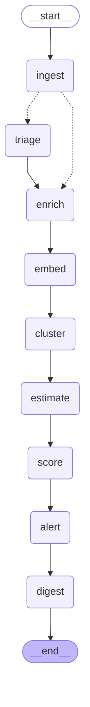

# Architecture de Signal

Vue d'ensemble : SPEC §6. Ce document décrit ce qui est construit ; il est complété au fil des étapes.

## Pipeline

Le pipeline d'ingestion est un **workflow** LangGraph (`src/pipeline/graph.ts`, ADR-001 et ADR-003). Le graphe ci-dessous est exporté du code (`drawMermaid()`) ; un test vérifie qu'il est à jour.

| Nœud       | Type                                          | Ce qu'il fait                                                                                                                                                                   |
| ---------- | --------------------------------------------- | ------------------------------------------------------------------------------------------------------------------------------------------------------------------------------- |
| `ingest`   | code                                          | Liste les retours sans analyse réussie (les échecs précédents sont retentés), les marque du `run_id`, photographie les insights émergents                                       |
| `triage`   | Sonnet (rôle `reasoning`, ADR-035), structuré | Fan-out par lots de 10 (`Send`), 2 lots en parallèle (`maxConcurrency`) × 4 appels ; un retour en échec est marqué `failed` sans bloquer le run                                 |
| `enrich`   | code                                          | Rattachement au compte, signaux business                                                                                                                                        |
| `embed`    | Voyage                                        | Vecteur « problème — résumé » des items qui n'en ont pas                                                                                                                        |
| `cluster`  | code + Sonnet                                 | Regroupement, appariement aux insights existants et étiquetage (un seul plan, écrit après tous les appels de modèle : c'est le trio `cluster` · `match` · `label` de SPEC §6.1) |
| `estimate` | Sonnet, en cache                              | Fourchette de points des insights classés                                                                                                                                       |
| `score`    | Sonnet + code                                 | Jugement par le modèle, calculs en code, nouvelle version dans `scores`                                                                                                         |
| `alert`    | code                                          | Seuils de SPEC §10.10 sur les retours du run ; rien au premier run (tout va au digest)                                                                                          |
| `digest`   | code + Sonnet                                 | Faits de la période calculés en code, rédaction par Signal (skill `digest`), ID vérifiés en code ; repli sur un rendu brut des faits si la rédaction échoue                     |

**État.** Le graphe ne transporte que des ID, des compteurs et des coûts (`run_id`, retours à trier, retours triés, insights créés, échecs, stats, coût) ; les données vivent dans Supabase.

**Idempotence et reprise (CL-11, CL-13).** Chaque nœud lit en base ce qui reste à faire. Le graphe est compilé avec un `PostgresSaver` (schéma `langgraph`, hors de l'API PostgREST) ; `pnpm pipeline:run --resume <run_id>` repart du dernier checkpoint : les nœuds terminés, et les lots de triage terminés, ne sont pas rejoués. Les erreurs passagères sont retentées une fois par nœud (`retryPolicy`).

**Verrou (CL-12).** `src/pipeline/lock.ts` prend `pg_try_advisory_lock` sur une connexion Postgres dédiée pour toute la durée d'un run, complet ou incrémental. Un second run réessaie pendant 30 s, puis abandonne avec « Run en cours, réessaie dans un instant. » (code 2 en CLI, 409 sur la route).

**Mode incrémental** (`src/pipeline/incremental.ts`, `POST /api/pipeline/incremental`). 1 à 10 retours : triage → enrich → embed → rattachement à l'insight le plus proche (similarité moyenne aux items de l'insight, comme le regroupement complet en _average linkage_, au même seuil) ou file « à surveiller » ; dès que 3 items de la file sont proches, nouvel insight `propose` → agrégats des insights touchés → re-score en code (le jugement du modèle stocké dans `scores.judgment` est réutilisé ; Reach, Confidence, règles MoSCoW, RICE et rangs sont recalculés pour tous ; seul un insight sans jugement valide, par exemple devenu classé, est jugé et estimé) → alertes. Le run complet de nuit rejuge tout. La réponse décrit, par retour, ce qu'il est devenu ; `pipeline_runs.stats.timings_ms` donne la durée de chaque étape.

**Alertes** (`src/pipeline/nodes/alert.ts`). Une alerte par sujet et par type sur 24 h (`dedup_key` = type | sujet | date) ; les suivantes enrichissent l'alerte ouverte (CL-55). Le sujet est l'insight, sauf pour `churn`, qui porte sur le compte.

**Digest** (`src/pipeline/nodes/digest.ts`, `pnpm digest`, `GET /api/cron/digest`). Période : depuis le digest précédent, ou depuis la dernière visite de Léa si elle est plus ancienne. Le code calcule les faits ; le modèle rédige chaque section ; un schéma zod refuse un ID absent des faits, une ligne chiffrée sans ID, un jour de la semaine ou une date absolue (une nouvelle tentative, puis repli). Le code assemble les sections dans l'ordre fixe de SPEC §12.2 et impose « Pas encore d'historique » quand aucun score n'existe avant la période (CL-18).

**Traces.** Un run = une trace Langfuse (`run-pipeline` ou `run-incremental`, session = `run_id`), un span par nœud ; coût, tokens, durée et lien de la trace dans `pipeline_runs` (`GET /api/pipeline/runs`).
